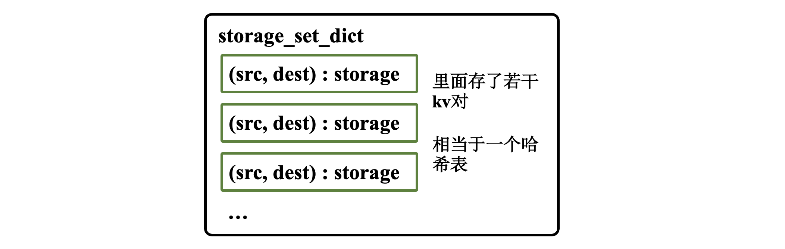
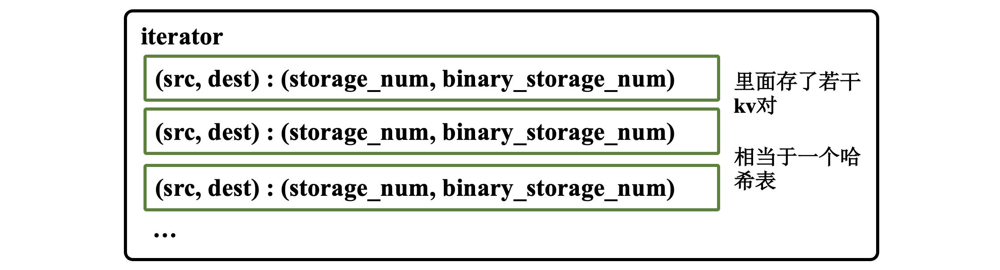
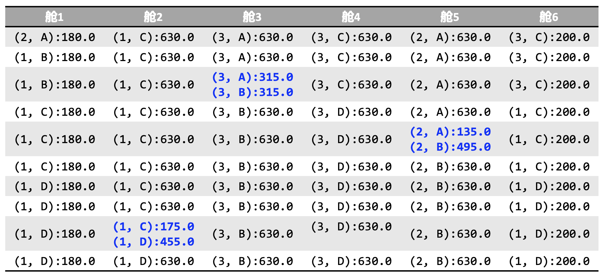

# Pulp-Carrier-Loading-Optimization-with-Gurobi
基于 Gurobi 的纸浆运载船顺序装卸决策建模求解。中山大学智能工程学院《运筹学》课程期末建模课程设计。优化工具：Python的Gurobi

***

## 摘要
本研究旨在解决一艘装载纸浆的船舶在其六个舱室内按顺序装卸纸浆包的优化问题。具体任务 包括规划船舶在三个装载地和四个送达地之间的纸浆包装卸顺序，以及在各舱室内的分布。考虑到舱室和 层级的容量限制，以及装载地与送达地之间的不同需求，该任务呈现出显著的复杂性。通过 Python 编程 语言和 Gurobi 优化器的应用，本研究成功构建并解决了这一问题。采用的数学模型涉及多重约束，包括 舱室容量限制、装卸顺序的严格遵循、以及装卸地点的特定组合限制。为最大限度地减少不同装载地-送达 地组合的混装情况，模型的目标函数专注于优化各层纸浆包的装载组合。在模型建立过程中，重点关注了 详尽的约束条件设定和决策变量的准确定义。优化过程中，模型能够有效地处理和解决各种复杂约束，最 终生成了满足所有要求的纸浆包装载和卸载方案。此外，本研究提供了模型求解的详细日志文档，并展示 了最优解的具体分布图，直观地展示了优化结果。

**关键词：** Gurobi 优化器，运载船装卸顺序，Python，约束条件和决策变量

## 问题描述

**船舶和货物信息:**

(1) 一艘船舶，分为六个货舱，每个货舱有十层。

(2) 货舱内每层可装载的纸浆包数量不同，如表 1 所示。

(3) 不同产地的纸浆包(大小相同)，具体数量和装载地信息见表 2 和表 3。

**航线:**

船舶从装载地 1 出发，依次经过装载地 1、2、3，然后前往送达地 A、B、C、D。 装卸顺序与约束:

(1) 装载时，纸浆包从下往上堆叠。

(2) 卸载时，从上往下卸载。

(3) 在每个装载或卸载地，不能同时打开 2、3 舱和 4、5 舱。

**目标函数:**

尽量减少不同装载地-送达地的纸浆包在同一层内混装的次数。

## 模型搭建

### 定义决策变量

设 $ x_{i j k l} $ 表示在第 $ i $ 舱室的第 $ j $ 层，从第 $ k $ 装载地装载到第 $ l $ 送达地的纸浆包数量。其中,  $ i $ 范围从 $ 1 $ 到舱室总数, $ j $ 范围从 1 到 每个舱室的层数,  $ k $ 范围从 $ 1 $ 到 装载地数量, $ l $ 范围从 $ 1 $ 到送达地数量。

**同时, 定义一个二进制变量 $ y_{i j k l} $  , 其值取决于 $ x_{i j k l} $ 是否大于 0 。如果 $ x_{i j k l}>0 $  ,则 $ y_{i j k l}=1 $ ; 否则,   $ y_{i j k l}=0 $  。**

$$
\begin{array}{cccccc}
\hline 1 \text { 舱 } & 2 \text { 舱 } & 3 \text { 舱 } & 4 \text { 舱 } & 5 \text { 舱 } & 6 \text { 舱 } \\
\hline 180 & 630 & 630 & 630 & 630 & 200 \\
180 & 630 & 630 & 630 & 630 & 200 \\
180 & 630 & 630 & 630 & 630 & 200 \\
180 & 630 & 630 & 630 & 630 & 200 \\
180 & 630 & 630 & 630 & 630 & 200 \\
180 & 630 & 630 & 630 & 630 & 200 \\
180 & 630 & 630 & 630 & 630 & 200 \\
180 & 630 & 630 & 630 & 630 & 200 \\
180 & 630 & 630 & 630 & 630 & 200 \\
180 & 630 & 630 & 630 & 630 & 200 \\
\hline
\end{array}
$$

表1 船舱内各层的纸浆包最大容量

$$
\begin{array}{cc}
\hline \text { 装载地编号 } & \text { 纸浆包数量 } \\
\hline 1 & 9320 \\
2 & 6480 \\
3 & 13200 \\
\hline
\end{array}
$$

表2 装载地及对应纸浆包数量

$$
\begin{array}{cccc}
\hline \text { 送达地编号 } & \text { 所需纸浆包所属的装载地编号 } & \text { 纸浆包类型 (装载地-送达地) } & \text { 所需纸浆包数量 } \\
\hline \text { A } & 2 & 2-A & 2835 \\
\text { A } & 3 & 3-A & 1575 \\
\text { B } & 1 & 1-B & 360 \\
\text { B } & 2 & 2-B & 3645 \\
\text { B } & 3 & 3-B & 4725 \\
\text { C } & 1 & 1-\mathrm{C} & 6355 \\
\text { C } & 3 & 3-C & 2490 \\
\text { D } & 1 & 1-D & 2605 \\
\text { D } & 3 & 3-D & 4410 \\
\hline
\end{array}
$$

表3 送达地及所需纸浆包信息

因此, 决策变量的数学表达为公式所示。

$$
x_{i j k l} \geq 0, \quad y_{i j k l} \in\{0,1\}, \quad y_{i j k l} \geq \frac{x_{i j k l}}{M}
$$

其中,  $ M $ 是一个足够大的数, 以保证 $ y_{i j k l} $ 的正确性。

### 约束一:舱室容量约束

对于每个舱室 $ i $ 和层 $ j $ ，定义了以下约束条件如公式2所示。

$$
\sum_{s=1}^{S} \sum_{d=1}^{D} x_{i j s d} \leq C_{i j}
$$

**其中：**

(1)  $ x_{ijsd} $ 表示在第 $ i $ 舱室的第 $ j $ 层，从第 $ s $ 装载地装载到第 $ d $ 送达地的纸浆包数量。

(2)  $ C_{ij} $ 是第 $ i $ 舱室的第 $ j $ 层的最大容量。

(3)  $ S $ 是装载地的总数。

(4)  $ D $ 是送达地的总数。

**约束一：即每个舱室每层的货物总量不得超过该层的最大容量。**

对于船舶的每个舱室 $ i $ 和每层 $ j $ ，计算所有来源装载地 $ s $ 和目的地 $ d $ 组合下的货物总量。这个总量必须小于或等于给定的舱室 $ i $ 和层 $ j $ 的最大容量。这样的设计确保了舱室内的货物不会超载，从而满足了物理限制和安全要求。

### 约束二：装载地供应限制

对于每个装载地 $ s $ ，定义了约束条件如公式所示。

$$
\sum_{i=1}^{I} \sum_{j=1}^{J} \sum_{d=1}^{D} x_{i j s d} \leq P_{s}
$$

**其中：**

(1)  $ x_{i j s d} $ 表示在第 $ i $ 舱室的第 $ j $ 层，从第 $ s $ 装载地装载到第 $ d $ 送达地的纸浆包数量。

(2)  $ P_s $ 是装载地 $ s $ 能提供的最大纸浆包数量。

(3)  $ I $ 是舱室总数。

(4)  $ J $ 是每个舱室的层数。

(5)  $ D $ 是送达地的总数。

这个约束表示了，对于每个装载地 $ s $ ，计算所有舱室 $ i $ 层 $ j $ 和送达地 $ d $ 组合下从该装载地装载的纸浆包总量。这个总量必须小于或等于装载地 $ s $ 能提供的最大纸浆包数量。这个约束确保了装载的纸浆包数量不会超过每个装载地的供应能力，遵守了装载地的物流和供应限制。

### 约束三：送达地所需要指定装载地的约束

按照表3所示。这个约束确保每个送达地接收到的纸浆包的总量正好满足其表3中需求量。这是为了保证每个送达地得到其从各个装载地订购的确切数量的纸浆包。

对于每个装载地 $ s $ 和每个送达地 $ d $ , 所有舱室 $ i $ 和层 $ j $ 中从装载地 $ s $ 发往送达地 $ d $ 的纸浆包的总数量 $ x_{i, j, s, d} $ 必须等于送达地 $ d $ 对于来自装载地 $ s $ 的纸浆包的需求量 $ D_{s, d} $ ，公式如公式所示。

$$
\sum_{i=1}^{I} \sum_{j=1}^{J} x_{i, j, s, d}=D_{s, d}, \quad \forall s \in S, \forall d \in D
$$

**其中：**

(1)  $ I $  是舱室的总数。

(2)  $ J $  是每个舱室的层数。

(3)  $ x_{i,j,s,d} $  是第  $ i $  个舱室的第  $ j $  层中，从装载地  $ s $  到送达地  $ d $  的纸浆包数量。

(4)  $ D_{s,d} $  是从装载地  $ s $  到送达地  $ d $  的需求量。

(5)  $ S $  和  $ D $  分别是装载地和送达地的集合。

### 约束四：送达地所需要指定装载地的约束

手册要求： 装载时，纸浆包只能自下层往上层放，不断堆叠;卸载时，自上而下卸载纸 浆包，即当前层的纸浆卸载完毕后才能卸载其下方的纸浆包。

这部分实现的是装卸顺序限制的约束。它确保了在每个仓舱的每层上，按照装载地和送达地的顺序正确地装载和卸载货物。具体来说，对于每个仓舱  $ i $  和每层  $ j $ ，该约束确保在装载地的顺序（1、2、3）中较后的货物不会被放置在较早的货物之下；同样地，对于送达地（A、B、C、D），较后的送达地的货物不会被放置在较早送达地的货物之下。这是为了在到达每个送达地时能够顺利卸载货物，不需要重新调整已经装载的货物。

用数学语言描述这个约束，可以表示为：

对于每个仓舱  $ i $  和每层  $ j $ ，若该层装有来自装载地  $ s $  的货物，则该层及其以上的层不能装有来自装载地  $ s' > s $  的货物。同样地，若该层装有前往送达地  $ d $  的货物，则该层及其以上的层不能装有前往送达地  $ d' > d $  的货物。

用公式表示，这个约束可以写为两部分，分别如两个公式所示。

$$
\forall i, j, s, d: x_{i, j, s, d}>0 \Rightarrow x_{i, j^{\prime}, s^{\prime}, d^{\prime}}=0, \quad \forall j^{\prime} \geq j, \forall s^{\prime}>s, \forall d^{\prime}
$$

$$
\forall i, j, s, d: x_{i, j, s, d}>0 \Rightarrow x_{i, j^{\prime}, s^{\prime}, d^{\prime}}=0, \quad \forall j^{\prime} \geq j, \forall s^{\prime}, \forall d^{\prime}>d   
$$

**其中：**

(1)  $ x_{i,j,s,d} $  表示在第  $ i $  个仓舱的第  $ j $  层装载地  $ s $  发往送达地  $ d $  的货物数量。

(2)  $ j' $  和  $ j $  分别是仓舱中的不同层级。

(3)  $ s' $  和  $ s $ ,  $ d' $  和  $ d $  分别是装载地和送达地的不同顺序。

### 约束五：部分舱门不能同时打开的限制

手册要求：在每个装载或卸载地时，不能同时打开 2、3 舱和 4、5 舱。

它确保了在装载或卸载货物时，第 2 和第 3 舱不会同时被操作，同样地，第 4 和第 5 舱也不会同时被操作。这意味着在任何给定的装载或卸载点，要么是第 2 舱或第 3 舱中的一个在操作，要么是第 4 舱或第 5 舱中的一个在操作。

用数学语言描述这个约束，可以表示为：

对于每个装载地  $ s $  和卸载地  $ d $ ，在任何时刻，第 2 舱和第 3 舱不能同时进行装载或卸载操作，同时第 4 舱和第 5 舱也不能同时进行装载或卸载操作。

用公式表示，这个约束可以写为公式7和公式8。

定义决策变量 $ X_{i, j, s, d} $ 为从装载地 $ s $ 到送达地 $ d $ 的纸浆包在舱位 $ i $ 的第 $ j $ 层的数量。

令 $ s $ 表示装载地编号 $ (s \in\{1,2,3\}) $ ,  $ d $ 表示送达地编号 $ (d \in\{A, B, C, D\}) $ ,  $ i $ 表示舱位编号 $ (i \in\{1,2,3,4,5,6\}) $ ，  $ j $ 表示舱位内的层数 $ (j \in\{1,2, \ldots, 10\}) $ ， $ j $ 表示舱位内的层数  $ (j \in\{1,2, \ldots, 10\}) $   。

对于每个装载地如公式所示。

$$
\begin{array}{l}
\sum_{j=1}^{10} \sum_{d \in\{A, B, C, D\}} X_{2, j, s, d} \cdot X_{3, j, s, d}=0 \\
\sum_{j=1}^{10} \sum_{d \in\{A, B, C, D\}} X_{4, j, s, d} \cdot X_{5, j, s, d}=0
\end{array}
$$

对于每个卸载地如公式所示。

$$
\begin{array}{l}
\sum_{j=1}^{10} \sum_{s=1}^{3} X_{2, j, s, d} \cdot X_{3, j, s, d}=0 \\
\sum_{j=1}^{10} \sum_{s=1}^{3} X_{4, j, s, d} \cdot X_{5, j, s, d}=0
\end{array}
$$

这表示，在任何给定的送达地，如果在舱位 2 或 3 中卸载了纸浆包，则不能在舱位 3 或 2 中卸载，同样的规则适用于舱位 4 和 5。这样的约束确保了在装载或卸载时，不会同时开启相邻的两个舱位，从而符合船舶的操作要求。

### 定义目标函数

**手册上的描述：不同装载地-送达地的纸浆包混装在同层的次数尽可能少。**

这个目标函数的目的是最小化不同装载地到送达地的纸浆包在同一层中混装的次数。换句话说，它旨在减少在每层货物中混合不同起始和目的地组合的情况，从而优化货物的排列顺序，以便于卸载和管理。

用数学语言描述这个目标函数如下：

令  $ i $  表示舱位编号（ $ i \in {1, 2, 3, 4, 5, 6} $ ）， $ j $  表示舱位内的层数（ $ j \in {1, 2, ..., 10} $ ）， $ s $  表示装载地编号（ $ s \in {1, 2, 3} $ ）， $ d $  表示送达地编号（ $ d \in {A, B, C, D} $ ）。定义决策变量  $ X_{i,j,s,d} $  为从装载地  $ s $  到送达地  $ d $  的纸浆包在舱位  $ i $  的第  $ j $  层的数量。

目标函数表达式如公式所示。

$$
\operatorname{Minimize} \sum_{i=1}^{6} \sum_{j=1}^{10} \sum_{s=1}^{3} \sum_{d \in\{A, B, C, D\}} X_{i, j, s, d}
$$

## 代码求解详细步骤过程

### 数据分离准备部分

#### (1) 设定项目的根目录，方便后续代码使用相对路径。

```
project_root_path = "/Users/demac/Desktop/src/op-main/"
```

**定义四个重要变量。**

**舱数，层数，装载地数量和目的地数量。这四个参数在后面会经常使用到。**

```
# 四个重要变量
compartments_num = 6  # 一共有6个仓舱
floors_in_each_compartment_num = 10  # 每个舱有10层
loading_sites_num = 3  # 装载地的数量
destination_num = 4  # 目的地的数量
```

#### (2) 读取每个舱位设置好的配置文件，并编写pair2storage函数，传入舱和层，返回该房间的最大容量

配置文件定义如下所示。每一列表示每一个舱，每一行表示每一层。

在读取的时候，Python代码会把这个conf文件当作csv文件进行读取。

```config
<storage.conf>
1,2,3,4,5,6
180,630,630,630,630,200
180,630,630,630,630,200
180,630,630,630,630,200
180,630,630,630,630,200
180,630,630,630,630,200
180,630,630,630,630,200
180,630,630,630,630,200
180,630,630,630,630,200
180,630,630,630,630,200
180,630,630,630,630,200
```

读取部分的代码如下。

```python
def load_storage(arr) -> dict:
    # 定义各舱室各层的最大容量(i,j)表示第i舱第j层的最大容量
    C = {}
    for ii in range(0, len(arr)):
        for jj in range(0, len(arr[ii])):
            # (ii,jj) 表示第ii行第jj列 -> 第ii+1层，在第jj+1舱，(jj+1,ii+1)表示第jj舱的第ii列
            C[(jj + 1, ii + 1)] = arr[ii][jj]
    return C
storage_set_dict = None # 定义全局字典，后面模型部分会用到
def init_storage():
    # 读取存储容量信息的csv
    df = pd.read_csv(project_root_path + "./storage.conf")
    arr = df.to_numpy().tolist()
    global storage_set_dict
    storage_set_dict = load_storage(
        arr
    )  # storage_set_dict是字典 (i,j)=storage, 第i舱第j层的最大容量为storage
```

load\_storage函数负责把读取好的内容按照一定的格式和规定转存到storage\_set\_dict这个字典中。然后模型部分的主函数，只需要调用init\_storage对storage\_set\_dict这个全局的字典进行初始化即可。

storage\_set\_dict定义图1所示。



图1 storage\_set\_dict结构，相当于一个哈希表

编写pair2storage函数，返回全局字典里面对应的值即可。

```python
def pair2storage(cabin, floor) -> int:
    return storage_set_dict[(cabin, floor)]
```

#### (3) 编写src2provide函数，传入装载地，返回该装载地可以提供的货物数量

思路是非常简单的，就是传入一个src返回对应的provide就行了。直接在这个函数里面定义provide数组。另外，使用assert保证传入的src是合法的。

```python
def src2provide(src) -> int:
    assert src >= 1 and src <= 3
    provide = [9320, 6480, 13200]  # provide[i]表示i+1装载地能提供的数量
    return provide[src - 1]
```

#### (4) 编写pair2demand函数，传入装载地和卸载地，返回卸载地需要的，对应的货物数量

在pair2demand函数里面按照表3对<i, j>(i代表装载地，j代表卸载地)所需要对应的货物数量，写成字典的形式，然后当外面传入src和dest的时候，返回对应的值即可。

```python
def pair2demand(src, dest) -> int:
    demand_dict = {
        (1, 1): 0,
        (2, 1): 2835,
        (3, 1): 1575,
        (1, 2): 360,
        (2, 2): 3645,
        (3, 2): 4725,
        (1, 3): 6355,
        (2, 3): 0,
        (3, 3): 2490,
        (1, 4): 2605,
        (2, 4): 0,
        (3, 4): 4410,
    }
    return demand_dict[(src, dest)]
```

### 辅助变量定义、初始化货物存放字典和模型的定义

具体代码如下所示。

**关于辅助变量大M大定义：在后续定义决策变量和约束的时候，对于二元变量的定义有很大作用，我会在后面详细解释。**

```python
# 定义辅助变量大M
M = 1e5
# 初始化货物存放的约束
init_storage()
# 定义模型
model = Model("CargoShipping")
```

### 模型决策变量定义

首先我会定义一个kv结构来存储(src, dest)到(storage\_num, binary\_storage\_num)。其中src是装载地，dest是卸货地，然后storage\_num是对应(src, dest)装的货物量，binary\_storage\_num是一个二元变量，表示是否有货物。

**如果对应的storage\_num非0，则binary\_storage\_num为1，如果storage\_num为0，则binary\_storage\_num为0。**

iterator结构如图2所示。



图2 iterator 结构

代码如下所示。

```python
# 定义决策变量
iterator = {}
# iterator是一个kv结构，k为一个4个元素的tuple，表示一种可能组合，v是一个2个元素的tuple，第一个元素表示
# 装载的量，第二个元素表示是否有装载，如果第一个元素非0，则第二个元素为1，否则为0
for cur_compartments_num in range(1, compartments_num + 1):
    for cur_floors_in_each_compartment_num in range(
        1, floors_in_each_compartment_num + 1
    ):
        for cur_loading_sites_num in range(1, loading_sites_num + 1):
            for cur_destination_num in range(1, destination_num + 1):
                # 四个循环暴力遍历
                cur_tuple = (
                    cur_compartments_num,
                    cur_floors_in_each_compartment_num,
                    cur_loading_sites_num,
                    cur_destination_num,
                )
                element1 = model.addVar(vtype=GRB.INTEGER, name=f"goods_{cur_tuple}")
                element2 = model.addVar(vtype=GRB.BINARY, name=f"is_goods_{cur_tuple}")
                # 构造一个元组，赋值给iterator[cur_tuple]
                iterator[cur_tuple] = (element1, element2)
                iterator[cur_tuple][1].Start = 0
                # 添加对应的约束
                model.addConstr(iterator[cur_tuple][0] >= 0)
                model.addConstr(iterator[cur_tuple][1] >= iterator[cur_tuple][0] / M)
```

函数的构造整体是非常简单的，首先就是通过四个循环遍历每一组元组的可能性。

一个元组的定义如下代码所示。

```python
cur_tuple = (cur_compartments_num,cur_floors_in_each_compartment_num,cur_loading_sites_num,cur_destination_num)
```

**在决策变量的定义的同时，也要添加两个默认的约束条件。**

(1) 每一个storage\_num都应该为正。

(2) binary\_storage\_num都应该和storage\_num对应起来。

在代码中，下面这部分代码添加约束可以满足这两个条件。通过辅助变量M可以控制binary\_storage\_num。

```python
model.addConstr(iterator[cur_tuple][0] >= 0)
model.addConstr(iterator[cur_tuple][1] >= iterator[cur_tuple][0] / M)
```

### 对于iterator结构的使用

使用如图3所示。key值和val值都是一个二元元组。


图3 iterator 结构使用

### 约束一的实现

**这个约束的实现非常简单，如公式2所示，只需要遍历每一种(src, dest)的情况，然后对每一种(src, dest)里面的货物分别求和，让这个和小于容量即可。**

代码如下所示。

```python
# 约束1
for i in range(1, compartments_num + 1):
    for j in range(1, floors_in_each_compartment_num + 1):
        # 遍历所有舱房间
        cur_room_sum = gp.quicksum(
            iterator[i, j, s, d][0]
            for s in range(1, loading_sites_num + 1)
            for d in range(1, destination_num + 1)
        )
        # 添加对应约束
        model.addConstr(cur_room_sum <= pair2storage(i, j))
```

### 约束二的实现

**这个约束的实现很简单，如公式3所示，只要对每一个装载地进行遍历，然后给每一个装载地添加一个约束，让每个装载地能提供的货物数量符合表2即可。**

代码如下所示。

```python
# 约束2
for s in range(1, loading_sites_num + 1):
    # 遍历所有装载地
    cur_s_load_sum = gp.quicksum(
        iterator[i, j, s, d][0]
        for i in range(1, compartments_num + 1)
        for j in range(1, floors_in_each_compartment_num + 1)
        for d in range(1, destination_num + 1)
    )
    # 添加对应约束
    model.addConstr(cur_s_load_sum <= src2provide(s))
```

### 约束三的实现

这个是送达地的限制，如公式4所示。送达地的限制是对每一组(src, dest)做要求的，所以需要遍历每一组(src,dest)即可。

**注意：这里的限制是等于的限制，不是小于等于的限制。**

代码如下所示。

```python
# 约束3
for s in range(1, loading_sites_num + 1):
    for d in range(1, destination_num + 1):
        # 遍历所有装载地和卸载地的组合
        cur_get_num = gp.quicksum(
            iterator[i, j, s, d][0]
            for i in range(1, compartments_num + 1)
            for j in range(1, floors_in_each_compartment_num + 1)
        )
        # 添加对应的约束
        model.addConstr(cur_get_num == pair2demand(s, d))
```

### 约束四的实现


具体来说，对于船舶的每个舱室  $ i $  和每层  $ j $ ，这个约束通过以下两个主要方面实现：

**装载顺序约束：**确保如果一层装载了来自某个装载地  $ s $  的货物，则所有在此之后的装载地  $ s' > s $  的货物不会被装载到这一层或更低层。换句话说，随着船舶的行进，新装载的货物只能放置在之前装载货物的上层。

**卸载顺序约束：**确保如果一层装载了要送往某个送达地  $ d $  的货物，则所有在此之前的送达地  $ d' < d $  的货物不会被装载到这一层或更低层。这样做的目的是在到达每个送达地时，最上面的层总是包含该送达地的货物，可以直接卸载。

代码如下所示。

```python
# 遍历每个舱室和每层
for i in range(1, compartments_num + 1):
    for j in range(1, floors_in_each_compartment_num + 1):
        # 对于每个装载地
        for s in range(1, loading_sites_num + 1):
            # 创建一个二元变量，表示当前层是否从装载地 s 装载货物
            the_goods_from_s = model.addVar(vtype=GRB.BINARY)
            # 确保如果当前层从装载地 s 装载了货物，则该变量为 1
            model.addConstrs(
                the_goods_from_s >= iterator[(i, j, s, d_)][1] / M
                for d_ in range(1, destination_num + 1)
            )
            # 创建一个二元变量，表示在当前层以下是否有来自后续装载地的货物
            the_goods_load_behind_s = model.addVar(vtype=GRB.BINARY)
            model.addConstrs(
                the_goods_load_behind_s >= iterator[(i, j_, s_, d_)][1] / M
                for j_ in range(1, j)
                for s_ in range(s + 1, loading_sites_num + 1)
                for d_ in range(1, destination_num + 1)
            )
            # 添加指示约束：如果当前层从装载地 s 装载了货物，
            # 则不能在当前层以下有来自后续装载地的货物
            model.addGenConstrIndicator(
                the_goods_from_s, 1, the_goods_load_behind_s == 0
            )
        # 对于每个送达地
        for d in range(1, destination_num + 1):
            # 创建一个二元变量，表示当前层是否有前往送达地 d 的货物
            the_goods_to_d = model.addVar(vtype=GRB.BINARY)
            model.addConstrs(
                the_goods_to_d >= iterator[(i, j, s_, d)][1] / M
                for s_ in range(1, loading_sites_num + 1)
            )
            # 创建一个二元变量，表示在当前层以下是否有前往先前送达地的货物
            the_goods_behind_to_d = model.addVar(vtype=GRB.BINARY)
            model.addConstrs(
                the_goods_behind_to_d >= iterator[(i, j_, s_, d_)][1] / M
                for j_ in range(1, j)
                for s_ in range(1, loading_sites_num + 1)
                for d_ in range(1, d)
            )
            # 添加指示约束：如果当前层有前往送达地 d 的货物，
            # 则不能在当前层以下有前往先前送达地的货物
            model.addGenConstrIndicator(the_goods_to_d, 1, the_goods_behind_to_d == 0)
```

### 约束五实现

这部分实现的是舱室使用限制的约束，目的是确保在装载或卸载货物时，不会同时操作第  $ 2 $  和第  $ 3 $  舱，以及第  $ 4 $  和第  $ 5 $  舱。这是为了安全和效率考虑，防止在装卸作业中发生冲突。

具体来说，对于每个装载地  $ s $  和卸载地  $ d $ ：

创建二元变量 goods\_load\_from\_s\_c2、goods\_load\_from\_s\_c3、goods\_load\_from\_s\_c4 和 goods\_load\_from\_s\_c5，分别表示第  $ 2 $ 、 $ 3 $ 、 $ 4 $  和  $ 5 $  舱在装载或卸载时是否被操作。

对每个舱室和每层，若有货物从该舱室装载或卸载，则相应的二元变量将被设置为  $ 1 $ 。
添加约束，确保第  $ 2 $  和第  $ 3 $  舱不会同时操作，同时第  $ 4 $  和第  $ 5 $  舱也不会同时操作。

代码如下所示。

```python
# 遍历每个装载地
for s in range(1, loading_sites_num + 1):
    # 为第 2、3、4、5 舱创建二元变量，表示是否有装卸操作
    goods_load_from_s_c2 = model.addVar(vtype=GRB.BINARY)
    goods_load_from_s_c3 = model.addVar(vtype=GRB.BINARY)
    goods_load_from_s_c4 = model.addVar(vtype=GRB.BINARY)
    goods_load_from_s_c5 = model.addVar(vtype=GRB.BINARY)

    # 添加约束以确保第 2 和第 3 舱不会同时操作
    model.addConstrs(
        goods_load_from_s_c2 >= iterator[2, j, s, d_][0] / M
        for j in range(1, floors_in_each_compartment_num + 1)
        for d_ in range(1, destination_num + 1)
    )
    model.addConstrs(
        goods_load_from_s_c3 >= iterator[3, j, s, d_][0] / M
        for j in range(1, floors_in_each_compartment_num + 1)
        for d_ in range(1, destination_num + 1)
    )
    model.addConstr(goods_load_from_s_c2 + goods_load_from_s_c3 <= 1)

    # 添加约束以确保第 4 和第 5 舱不会同时操作
    model.addConstrs(
        goods_load_from_s_c4 >= iterator[4, j, s, d_][0] / M
        for j in range(1, floors_in_each_compartment_num + 1)
        for d_ in range(1, destination_num + 1)
    )
    model.addConstrs(
        goods_load_from_s_c5 >= iterator[5, j, s, d_][0] / M
        for j in range(1, floors_in_each_compartment_num + 1)
        for d_ in range(1, destination_num + 1)
    )
    model.addConstr(goods_load_from_s_c4 + goods_load_from_s_c5 <= 1)

# 遍历每个卸载地，重复类似的约束，确保在卸载操作中也不会同时操作这些舱室
for d in range(1, destination_num + 1):
    goods_deload_to_d_c2 = model.addVar(vtype=GRB.BINARY)
    goods_deload_to_d_c3 = model.addVar(vtype=GRB.BINARY)
    goods_deload_to_d_c4 = model.addVar(vtype=GRB.BINARY)
    goods_deload_to_d_c5 = model.addVar(vtype=GRB.BINARY)

    # 添加约束以确保第 2 和第 3 舱在卸载时不会同时操作
    model.addConstrs(
        goods_deload_to_d_c2 >= iterator[2, j, s_, d][0] / M
        for j in range(1, floors_in_each_compartment_num + 1)
        for s_ in range(1, loading_sites_num + 1)
    )
    model.addConstrs(
        goods_deload_to_d_c3 >= iterator[3, j, s_, d][0] / M
        for j in range(1, floors_in_each_compartment_num + 1)
        for s_ in range(1, loading_sites_num + 1)
    )
    model.addConstr(goods_deload_to_d_c2 + goods_deload_to_d_c3 <= 1)

    # 添加约束以确保第 4 和第 5 舱在卸载时不会同时操作
    model.addConstrs(
        goods_deload_to_d_c4 >= iterator[4, j, s_, d][0] / M
        for j in range(1, floors_in_each_compartment_num + 1)
        for s_ in range(1, loading_sites_num + 1)
    )
    model.addConstrs(
        goods_deload_to_d_c5 >= iterator[5, j, s_, d][0] / M
        for j in range(1, floors_in_each_compartment_num + 1)
        for s_ in range(1, loading_sites_num + 1)
    )
    model.addConstr(goods_deload_to_d_c4 + goods_deload_to_d_c5 <= 1)
```

### 更新模型以集成变量和约束

代码如下所示。

```python
model.update()
```

### 定义优化目标

遍历每个舱室（ $ i $ ）、每层（ $ j $ ）、每个装载地（ $ s $ ）和每个送达地（ $ d $ ）。
对于每种可能的装载地-送达地组合（ $ s $ , $ d $ ）在每个舱室的每层（ $ i $ , $ j $ ），使用二元变量 `iterator[i, j, s, d][1]`来表示该组合是否存在于该层。
优化目标是最小化所有舱室的所有层中这些二元变量的总和，即最小化混装次数。

代码如下所示。

```python
# 设置模型的目标函数：最小化不同装载地-送达地的纸浆包混装在同层的次数
model.setObjective(
    # 计算每个舱室的每层中不同装载地和送达地组合的总数
    gp.quicksum(
        iterator[i, j, s, d][1]  # 二元变量，表示特定组合是否存在于特定舱室和层
        for i in range(1, compartments_num + 1)  # 遍历所有舱室
        for j in range(1, floors_in_each_compartment_num + 1)  # 遍历所有层
        for s in range(1, loading_sites_num + 1)  # 遍历所有装载地
        for d in range(1, destination_num + 1)  # 遍历所有送达地
    ),
    GRB.MINIMIZE,  # 目标是最小化该总和
)
```

## 模型求解和结果记录

### 模型求解和结果记录部分代码

代码如下所示。

```python
# ----------------- 求解模型 ---------------------- #
model.Params.MIPFocus = 3 
# 启动求解过程
model.optimize()
# ----------------- 记录结果 -------------------- #
if model.status == GRB.OPTIMAL:
    # 如果有解，调用output_optimal_solution进行结果的输出
    model_write_path = project_root_path + "./model.lp"
    output_optimal_solution(model, model_write_path, iterator)
elif model.status == GRB.INFEASIBLE:
    # 找不到解
    print("Cannot found solution")
elif model.status == GRB.INF_OR_UNBD: 
    # 无解
    print("The model has no solution or is unbounded")
else:
    # 优化还没有完成，中断
    print("The optimization process was not successfully completed")
```

### 关于`model.Params.MIPFocus`参数的设置

model.Params.MIPFocus 是 Gurobi 优化器中的一个参数，用于指导求解器在求解混合整数规划（Mixed Integer Programming, MIP）问题时应该关注的重点。参数 MIPFocus 可以设置为不同的值，以影响求解器在寻找最优解过程中的行为。具体来说，MIPFocus 的设置如下：

(1) MIPFocus = 0：默认值。求解器平衡在找到可行解和寻找更好的界限之间的时间。

(2) MIPFocus = 1：当你更关心找到一个可行解而不是证明最优性时使用。这个设置使得求解器更加集中于找到可行解。

(3) MIPFocus = 2：当最优解的质量比证明最优性更重要时使用。这个设置使得求解器更加集中于提高当前已找到的解的质量。

(4) MIPFocus = 3：当对找到的解证明其最优性比提高解的质量更重要时使用。这个设置使得求解器更加集中于尽快证明当前解的最优性。

在代码中，model.Params.MIPFocus = 3 意味着求解器会优先寻求证明当前找到的解的最优性，而不是花费更多时间去寻找可能更好但是难以找到的解。这通常在认为当前解已经足够好，或者在有严格的时间限制时使用。

### `output_optimal_solution`函数的实现

这个函数思路是非常简单的，只需要遍历iterator结构最后的结果就可以了。然后通过一定格式打印出来即可。

代码如下所示。

```python
def output_optimal_solution(model, model_write_path, iterator):
    print("The optimal solution is founded.")
    # 保存模型的求解过程
    model.write(model_write_path)
    # 打印每个决策变量的值
    for iter in iterator:
        if iterator[iter][0].X > 0:
            print(
                f"goods in ({iter[0]},{iter[1]}):<{iter[2]}->{iter[3]}>:{iterator[iter][0].X}"
            )
    # 打印目标函数的值
    print(f"Optimal objective value: {model.ObjVal}")
    for j in range(floors_in_each_compartment_num, 0, -1):
        for i in range(1, compartments_num + 1):
            for s in range(1, loading_sites_num + 1):
                for d in range(1, destination_num + 1):
                    if iterator[i, j, s, d][0].X != 0:
                        print(f"({s}, {d}):{iterator[i,j,s,d][0].X}", end="\t")
        print()
```

## 建模求解结果

### 求解日志文档

**Gurobi的求解文档如下所示。**

```log
Using license file /Library/gurobi/gurobi.lic
Changed value of parameter MIPFocus to 3
   Prev: 0  Min: 0  Max: 3  Default: 0
Gurobi Optimizer version 9.1.2 build v9.1.2rc0 (mac64)
Thread count: 8 physical cores, 8 logical processors, using up to 8 threads
Optimize a model with 12029 rows, 2308 columns and 25348 nonzeros
Model fingerprint: 0x169e7f47
Model has 420 general constraints
Variable types: 0 continuous, 2308 integer (1588 binary)
Coefficient statistics:
  Matrix range     [1e-05, 1e+00]
  Objective range  [1e+00, 1e+00]
  Bounds range     [1e+00, 1e+00]
  RHS range        [1e+00, 1e+04]

User MIP start did not produce a new incumbent solution

Presolve removed 3572 rows and 944 columns
Presolve time: 0.10s
Presolved: 8457 rows, 1364 columns, 17856 nonzeros
Variable types: 0 continuous, 1364 integer (824 binary)
Presolve removed 540 rows and 540 columns
Presolved: 7917 rows, 824 columns, 16776 nonzeros


Root relaxation: objective 6.000000e+01, 1453 iterations, 0.09 seconds
Another try with MIP start

    Nodes    |    Current Node    |     Objective Bounds      |     Work
 Expl Unexpl |  Obj  Depth IntInf | Incumbent    BestBd   Gap | It/Node Time

     0     0   60.00000    0  325          -   60.00000      -     -    0s
     0     0   60.00000    0  193          -   60.00000      -     -    0s
     0     0   60.00000    0  221          -   60.00000      -     -    0s
     0     0   60.00000    0  301          -   60.00000      -     -    1s
     0     0   60.00000    0  301          -   60.00000      -     -    1s
     0     2   60.00000    0  260          -   60.00000      -     -    2s
   396   223   60.89492    6  353          -   60.33333      -   353    5s
H  675   380                      64.0000000   60.43762  5.57%   308    6s
H  684   357                      63.0000000   60.43762  4.07%   306    6s
   937   452     cutoff   10        63.00000   60.53643  3.91%   313   10s
  1481   796   60.66667   12  301   63.00000   60.66667  3.70%   274   18s
  1486   799   61.83456   18  286   63.00000   60.66667  3.70%   273   20s
  1489   801   60.73218   18  331   63.00000   60.66667  3.70%   272   25s
  1498   809   60.69722    8  346   63.00000   60.66667  3.70%   287   30s
  1503   811   60.66667   25  347   63.00000   60.66667  3.70%  29.7   36s
  1520   822   60.66667   28  429   63.00000   60.66667  3.70%  40.0   40s
  1748   957   60.66667   34  414   63.00000   60.66667  3.70%   157   46s
  2039  1115 infeasible   50        63.00000   60.66667  3.70%   234   51s
  2269  1189 infeasible   39        63.00000   60.66667  3.70%   282   55s
  2355  1166 infeasible   38        63.00000   60.66667  3.70%   317   61s
  2453  1200   60.66667   45  532   63.00000   60.66667  3.70%   369   66s
  2618  1237   60.66667   39  469   63.00000   60.66667  3.70%   432   72s
  2734  1248   60.66667   32  365   63.00000   60.66667  3.70%   474   77s
  2780  1249 infeasible   35        63.00000   60.66667  3.70%   494   84s
  2805  1251     cutoff   36        63.00000   60.66667  3.70%   511   85s
  2837  1242 infeasible   38        63.00000   60.66667  3.70%   526   90s
  2927  1225 infeasible   41        63.00000   60.66667  3.70%   559  113s
  2965  1211     cutoff   38        63.00000   60.66667  3.70%   572  156s
  3070  1206 infeasible   35        63.00000   60.66667  3.70%   593  160s
  3149  1199   60.66667   36  427   63.00000   60.66667  3.70%   621  177s
  3286  1177 infeasible   53        63.00000   60.66667  3.70%   641  202s
  3344  1168   60.73041   39  351   63.00000   60.66667  3.70%   654  210s
  3405  1154   60.66667   49  454   63.00000   60.66667  3.70%   665  225s
  3480  1112 infeasible   43        63.00000   60.66667  3.70%   683  286s
  3557  1097     cutoff   38        63.00000   60.66667  3.70%   690  309s
  3612  1077 infeasible   37        63.00000   60.66667  3.70%   704  356s
  3700  1077     cutoff   39        63.00000   60.66667  3.70%   713  363s
  3726  1061 infeasible   41        63.00000   60.66667  3.70%   719  365s
  3798  1044   60.66667   42  463   63.00000   60.66667  3.70%   729  419s
  3876  1015 infeasible   43        63.00000   60.66667  3.70%   737  424s
  3998  1021 infeasible   38        63.00000   60.66667  3.70%   738  427s
  4084  1021   61.06589   42  382   63.00000   60.66667  3.70%   747  479s
  4162   981     cutoff   42        63.00000   60.66667  3.70%   754  518s
  4266  1000   60.66667   46  441   63.00000   60.66667  3.70%   759  600s
  4286   972     cutoff   41        63.00000   60.66667  3.70%   762  692s
  4405   971   60.66667   47  328   63.00000   60.66667  3.70%   765  785s
  4543  1019   61.05556   41  285   63.00000   60.66667  3.70%   769  878s
  4647   989   61.00794   37  352   63.00000   60.66667  3.70%   781  967s
  4785   990   60.89594   47  439   63.00000   60.66667  3.70%   787 1056s
  4943   981     cutoff   48        63.00000   60.66667  3.70%   785 1102s
  5129   985   61.64757   39  284   63.00000   60.71785  3.62%   780 1215s
  5329  1026   61.18544   40  438   63.00000   60.80765  3.48%   775 1377s
  5534  1051   60.86582   39  502   63.00000   60.83492  3.44%   774 1564s
  5769  1168     cutoff   84        63.00000   60.94419  3.26%   768 1773s
  5856  1272 infeasible   40        63.00000   60.97707  3.21%   765 1965s
  6186  1482 infeasible   37        63.00000   61.00794  3.16%   747 2153s
  6585  1657   61.36190   36  248   63.00000   61.00794  3.16%   721 2327s
  7008  1856   61.06309   42  316   63.00000   61.05556  3.09%   694 2526s
  7582  2021   61.14118   60  197   63.00000   61.07342  3.06%   659 2767s
  8114  2140   61.49990   56  221   63.00000   61.12534  2.98%   635 3014s
  8758  2281     cutoff   47        63.00000   61.18140  2.89%   605 3222s
  9364  2345   61.21789   57   97   63.00000   61.21786  2.83%   579 3478s
 10137  2475     cutoff   35        63.00000   61.25395  2.77%   551 3784s
 10539  2262     cutoff   41        63.00000   61.25395  2.77%   541 9640s
 11417  2245   61.38157   54  339   63.00000   61.37931  2.57%   512 10333s
 12318  2111   61.75690   42  264   63.00000   61.45919  2.45%   486 10592s
 13355  1950     cutoff   62        63.00000   61.56703  2.27%   460 10778s
 14359  1888     cutoff   45        63.00000   61.62642  2.18%   435 10906s
 15002  1539     cutoff   53        63.00000   61.70588  2.05%   421 11139s
 17071  1165     cutoff   54        63.00000   61.78252  1.93%   378 11357s
 18859   535     cutoff   56        63.00000   61.85184  1.82%   350 11585s
 20173     0   61.93453   50  142   63.00000   61.88423  1.77%   331 11748s

Cutting planes:
  Gomory: 16
  Cover: 195
  Projected implied bound: 415
  Clique: 98
  MIR: 1239
  StrongCG: 199
  Flow cover: 247
  Inf proof: 8
  Zero half: 230
  Network: 6
  RLT: 939
  Relax-and-lift: 2292

Explored 21008 nodes (7175002 simplex iterations) in 11748.72 seconds
Thread count was 8 (of 8 available processors)

Solution count 2: 63 64 

Optimal solution found (tolerance 1.00e-04)
Best objective 6.300000000000e+01, best bound 6.300000000000e+01, gap 0.0000%
The optimal solution is founded.
Warning: variable name "goods_(1, 1, 1, 1)" has a space
Warning: to let Gurobi read it back, use rlp format

Optimal objective value: 63.0
(2, 1):180.0 (1, 3):630.0 (3, 1):630.0 (3, 3):630.0 (2, 1):630.0 (3, 3):200.0	
(1, 2):180.0 (1, 3):630.0	(3, 1):630.0 (3, 3):630.0 (2, 1):630.0 (3, 3):200.0	
(1, 2):180.0 (1, 3):630.0	(3, 1):315.0 (3, 2):315.0 (3, 3):630.0 (2, 1):630.0	(3, 3):200.0	
(1, 3):180.0 (1, 3):630.0	(3, 2):630.0 (3, 4):630.0 (2, 1):630.0 (1, 3):200.0	
(1, 3):180.0 (1, 3):630.0	(3, 2):630.0 (3, 4):630.0 (2, 1):135.0 (2, 2):495.0	(1, 3):200.0	
(1, 3):180.0 (1, 3):630.0	(3, 2):630.0 (3, 4):630.0 (2, 2):630.0 (1, 3):200.0	
(1, 4):180.0 (1, 3):630.0	(3, 2):630.0 (3, 4):630.0 (2, 2):630.0 (1, 4):200.0	
(1, 4):180.0 (1, 3):630.0	(3, 2):630.0 (3, 4):630.0 (2, 2):630.0 (1, 4):200.0	
(1, 4):180.0 (1, 3):175.0	(1, 4):455.0 (3, 2):630.0 (3, 4):630.0 (2, 2):630.0	(1, 4):200.0	
(1, 4):180.0 (1, 4):630.0	(3, 2):630.0 (3, 4):630.0 (2, 2):630.0 (1, 4):200.0	
```

### 求解信息整理

**根据您提供的求解文档，以下是主要信息的整理：**

(1) 模型参数设置:

- 使用的 Gurobi 优化器版本为 9.1.2。

- MIPFocus 参数被设为 3，表明优先寻求证明当前解的最优性。

(2) 模型规模:

- 模型包含 12,029 行，2,308 列，以及 25,348 个非零元素。

- 模型具有 420 个一般约束。

- 变量类型：全部为整数变量，其中 1,588 个为二元变量。

(3) 求解过程:

- 预处理后，模型被减少到 8,457 行和 1,364 列。

- 根节点松弛解的目标函数值为 60。

- 总计探索了 21,008 个节点，并进行了 7,175,002 次单纯形迭代。

- 求解过程耗时 11,748.72 秒（约 3.26 小时）。

(4)求解结果:

- 找到的最优目标函数值为 63.0。

- Gap为 0.0000%，表明找到的解是最优解。

最终解中不同舱室和层的货物分布情况被具体列出。

### 最优目标函数值和最优解展示图

**最优目标函数值为63.0。**

最优解展示图如图4所示。



图4 最优解展示图

**如图所示，最小混装的房间数量为3。**

## 源代码`op-main`目录

- `op-main`目录：为源代码和源文件的根目录
- `op-main/main.py`：源python代码
- `op-main/model.lp`：保存的最优模型
- `op-main/run.log`：Gurobi的运行日志
- `op-main/start_optimal.sh`：程序运行脚本
- `op-main/storage.conf`：容量的配置文件
